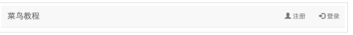
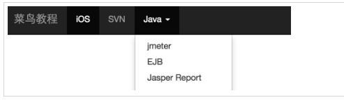
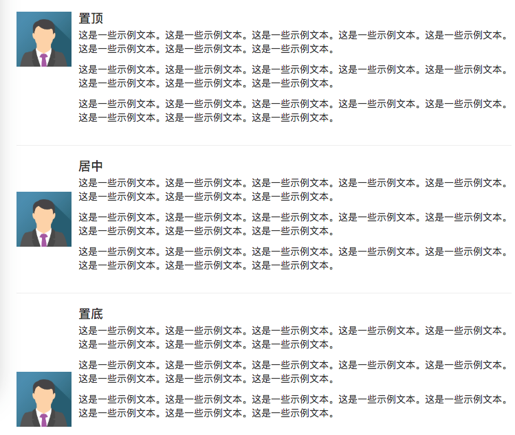

Bootstrap notes

## **一、网格系统**

### 响应式网格系统

系统会自动分为最多12列：数字越大越宽


|              | 超小设备手机（<768px） | 小型设备平板电脑（≥768px）   | 中型设备台式电脑（≥992px）   | 大型设备台式电脑（≥1200px）  |
| ------------ | ---------------------- | ---------------------------- | ---------------------------- | ---------------------------- |
| 网格行为     | 一直是水平的           | 以折叠开始，断点以上是水平的 | 以折叠开始，断点以上是水平的 | 以折叠开始，断点以上是水平的 |
| 最大容器宽度 | None (auto)            | 750px                        | 970px                        | 1170px                       |
| Class 前缀   | **.col-xs-***          | **.col-sm-***                | **.col-md-***                | **.col-lg-***                |

### 基本结构

```html
<div class="container">
   <div class="row">
      <div class="col-*-*"></div>
      <div class="col-*-*"></div>      
   </div>
   <div class="row">...</div>
</div>
<div class="container">....
```

### 偏移列

使用 **.col-md-offset-\*** 类。这些类会把一个列的左外边距（margin）增加 ***** 列，其中 ***** 范围是从 **1** 到 **11**。用来给列腾出更多的空间

例：

```html
<div class="container">
    <h1>Hello, world!</h1>
    <div class="row" >
        <div class="col-md-6 col-md-offset-3" 
        style="background-color: #dedef8;box-shadow: 
        inset 1px -1px 1px #444, inset -1px 1px 1px #444;">
            <p>Lorem ipsum dolor sit amet, consectetur adipisicing 
            elit.
            </p>
        </div>
    </div>
</div>
```


### 响应式列重叠

可以使用 **.clearfix** class解决,在<div></div><div></div>......<div></div><div></div>中间添加该类：

```html
<div class="clearfix visible-xs"></div>
```

### 嵌套列

为了在内容中嵌套默认的网格，请添加一个新的 **.row**，并在一个已有的 **.col-md-\*** 列内添加一组 **.col-md-\*** 列，这组列个数不能超过12

```html
<div class="container">
    <h1>Hello, world!</h1>
    <div class="row">
        <div class="col-md-3" style="background-color: #dedef8;box-shadow: inset 1px -1px 1px #444, inset -1px 1px 1px #444;">
            <h4>第一列</h4>
            <p>
                Lorem ipsum dolor sit amet, consectetur adipisicing elit.
            </p>
        </div>
        <div class="col-md-9" style="background-color: #dedef8;box-shadow: inset 1px -1px 1px #444, inset -1px 1px 1px #444;">
            <h4>第二列 - 分为四个盒子</h4>
            <div class="row">
                <div class="col-md-6" style="background-color: #B18904; box-shadow: inset 1px -1px 1px #444, inset -1px 1px 1px #444;">
                    <p>
                        Consectetur art party Tonx culpa semiotics. Pinterest 
        assumenda minim organic quis.
                    </p>
                </div>
                <div class="col-md-6" style="background-color: #B18904; box-shadow: inset 1px -1px 1px #444, inset -1px 1px 1px #444;">
                    <p>
                         sed do eiusmod tempor incididunt ut labore et dolore magna 
        aliqua. Ut enim ad minim veniam, quis nostrud exercitation 
        ullamco laboris nisi ut aliquip ex ea commodo consequat.
                    </p>
                </div>
            </div>
            <div class="row">
                <div class="col-md-6" style="background-color: #B18904; box-shadow: inset 1px -1px 1px #444, inset -1px 1px 1px #444;">
                    <p>
                        quis nostrud exercitation ullamco laboris nisi ut 
        aliquip ex ea commodo consequat.
                    </p>
                </div>
                <div class="col-md-6" style="background-color: #B18904; box-shadow: inset 1px -1px 1px #444, inset -1px 1px 1px #444;">
                    <p>
                        Lorem ipsum dolor sit amet, consectetur adipisicing elit, 
        sed do eiusmod tempor incididunt ut labore et dolore magna 
        aliqua. Ut enim ad minim.
                    </p>
                </div>
            </div>
        </div>
    </div>
</div>
```


### 列排序

可以很容易地以一种顺序编写列，然后以另一种顺序显示列。轻易地改变带有 **.col-md-push-\*** 和 **.col-md-pull-\*** 类的内置网格列的顺序，其中 ***** 范围是从 **1** 到 **11**。

```html
<div class="container">
    <h1>Hello, world!</h1>
    <div class="row">
        <p>
            排序前
        </p>
        <div class="col-md-4" style="background-color: #dedef8; box-shadow: inset 1px -1px 1px #444, inset -1px 1px 1px #444;">
         我在左边
        </div>
        <div class="col-md-8" style="background-color: #dedef8; box-shadow: inset 1px -1px 1px #444, inset -1px 1px 1px #444;">
         我在右边
        </div>
    </div>
    <br>
    <div class="row">
        <p>
            排序后
        </p>
        <div class="col-md-4 col-md-push-8" style="background-color: #dedef8; box-shadow: inset 1px -1px 1px #444, inset -1px 1px 1px #444;">
         我在左边
        </div>
        <div class="col-md-8 col-md-pull-4" style="background-color: #dedef8; box-shadow: inset 1px -1px 1px #444, inset -1px 1px 1px #444;">
         我在右边
        </div>
    </div>
</div>
```


## 二、排版类

| lead                | 使段落突出显示                                               |      |
| ------------------- | ------------------------------------------------------------ | ---- |
| .small              | 设定小文本 (设置为父文本的 85% 大小)                         |      |
| .text-left          | 设定文本左对齐                                               |      |
| .text-center        | 设定文本居中对齐                                             |      |
| .text-right         | 设定文本右对齐                                               |      |
| .text-justify       | 设定文本对齐,段落中超出屏幕部分文字自动换行                  |      |
| .text-nowrap        | 段落中超出屏幕部分不换行                                     |      |
| .text-lowercase     | 设定文本小写                                                 |      |
| .text-uppercase     | 设定文本大写                                                 |      |
| .text-capitalize    | 设定单词首字母大写                                           |      |
| .initialism         | 显示在 <abbr> 元素中的文本以小号字体展示，且可以将小写字母转换为大写字母 |      |
| .blockquote-reverse | 设定引用右对齐                                               |      |
| .list-unstyled      | 移除默认的列表样式，列表项中左对齐 ( <ul> 和 <ol> 中)。 这个类仅适用于直接子列表项    (如果需要移除嵌套的列表项，你需要在嵌套的列表中使用该样式) |      |
| .list-inline        | 将所有列表项放置同一行                                       |      |
| .dl-horizontal      | 该类设置了浮动和偏移，应用于 <dl> 元素和 <dt> 元素中，具体实现可以查看实例 |      |
| .pre-scrollable     | 使 <pre> 元素可滚动，代码块区域最大高度为340px,一旦超出这个高度,就会在Y轴出现滚动条 |      |

## 三、表格

下表样式可用于表格中：<table class='table'>

### table类

| 类               | 描述                                            |      |
| ---------------- | ----------------------------------------------- | ---- |
| .table           | 为任意 <table> 添加基本样式 (只有横向分隔线)    |      |
| .table-striped   | 在 <tbody> 内添加斑马线形式的条纹 ( IE8 不支持) |      |
| .table-bordered  | 为所有表格的单元格添加边框                      |      |
| .table-hover     | 在 <tbody> 内的任一行启用鼠标悬停状态           |      |
| .table-condensed | 让表格更加紧凑                                  |      |

### tr, th 和 td 类

下表的类可用于表格的行或者单元格：

| .active  | 将悬停的颜色应用在行或者单元格上 |      |
| -------- | -------------------------------- | ---- |
| .success | 表示成功的操作                   |      |
| .info    | 表示信息变化的操作               |      |
| .warning | 表示一个警告的操作               |      |
| .danger  | 表示一个危险的操作               |      |

### 响应式表格

通过把任意的 *.table* 包在 <div class='table-responsive'>内，您可以让表格水平滚动以适应小型设备

## 四、表单和控件

### 表单：

Bootstrap 提供了下列类型的表单布局：

- 垂直表单（默认）
- 内联表单
- 水平表单

支持最常见的表单控件，主要是 *input、textarea、checkbox、radio 和 select*, 同时向所有的文本元素 <input>、<textarea> 和 <select> 添加 class ="*form-control*"

#### 垂直或基本表单：

- 向父 <form> 元素添加 *role="form"* <form role="form">
- 把标签和控件放在一个带有 class *.form-group* 的 <div> 中。这是获取最佳间距所必需的。

<--! div class='form-group'>

- 向所有的文本元素 <input>、<textarea> 和 <select> 添加 class ="*form-control*" 。

<input type="text" class="form-control" id="name" placeholder="请输入名称">

```html
<form role="form">
  <div class="form-group">
    <label for="name">名称</label>
    <input type="text" class="form-control" id="name" placeholder="请输入名称">
  </div>
  <div class="form-group">
    <label for="inputfile">文件输入</label>
    <input type="file" id="inputfile">
    <p class="help-block">这里是块级帮助文本的实例。</p>
  </div>
  <div class="checkbox">
    <label>
      <input type="checkbox">请打勾
    </label>
  </div>
  <button type="submit" class="btn btn-default">提交</button>
</form>
```


#### 内联表单:

如果需要创建一个表单，它的所有元素是内联的，向左对齐的，标签是并排的，请向 <form> 标签添加 class *.form-inline*

```html
<form class="form-inline" role="form">
  <div class="form-group">
    <label class="sr-only" for="name">名称</label>
    <input type="text" class="form-control" id="name" placeholder="请输入名称">
  </div>
  <div class="form-group">
    <label class="sr-only" for="inputfile">文件输入</label>
    <input type="file" id="inputfile">
  </div>
  <div class="checkbox">
    <label>
      <input type="checkbox">请打勾
    </label>
  </div>
  <button type="submit" class="btn btn-default">提交</button>
</form>
```


#### 水平表单:

- 向父 <form> 元素添加 class *.form-horizontal*。
- 把标签<label>和控件放在一个带有 class *.form-group* 的 <div> 中。
- 向标签<label>添加 class *.control-label*。

```html
<form class="form-horizontal" role="form">
  <div class="form-group">
    <label for="firstname" class="col-sm-2 control-label">名字</label>
    <div class="col-sm-10">
      <input type="text" class="form-control" id="firstname" placeholder="请输入名字">
    </div>
  </div>
  <div class="form-group">
    <label for="lastname" class="col-sm-2 control-label">姓</label>
    <div class="col-sm-10">
      <input type="text" class="form-control" id="lastname" placeholder="请输入姓">
    </div>
  </div>
  <div class="form-group">
    <div class="col-sm-offset-2 col-sm-10">
      <div class="checkbox">
        <label>
          <input type="checkbox">请记住我
        </label>
      </div>
    </div>
  </div>
  <div class="form-group">
    <div class="col-sm-offset-2 col-sm-10">
      <button type="submit" class="btn btn-default">登录</button>
    </div>
  </div>
</form>
```


### 表单控件

#### 输入框input：

input 类型的支持，包括：*text、password、datetime、datetime-local、date、month、time、week、number、email、url、search、tel* 和 *color*

```html
<form role="form">
  <div class="form-group">
    <label for="name">标签</label>
    <input type="text" class="form-control" placeholder="文本输入">
  </div>
<form>
```

#### 输入框组input-group:

- 把前缀或后缀元素放在一个带有 class **.input-group** 的 <div> 中。
- 接着，在相同的 <div> 内，在 class 为 **.input-group-addon** 的 <span> 内放置额外的内容。
- 把该 <span> 放置在 <input> 元素的前面或者后面。

```html
<div style="padding: 100px 100px 10px;">
    <form class="bs-example bs-example-form" role="form">
        <div class="input-group">
            <span class="input-group-addon">@</span>
            <input type="text" class="form-control" placeholder="twitterhandle">
        </div>
        <br>
        <div class="input-group">
            <input type="text" class="form-control">
            <span class="input-group-addon">.00</span>
        </div>
        <br>
        <div class="input-group">
            <span class="input-group-addon">$</span>
            <input type="text" class="form-control">
            <span class="input-group-addon">.00</span>
        </div>
    </form>
</div>
```


##### 输入框组的大小

向 **.input-group** 添加相对表单大小的 class（比如 **.input-group-lg、input-group-sm**）来改变输入框组的大小

```html
<div style="padding: 100px 100px 10px;">
    <form class="bs-example bs-example-form" role="form">
        <div class="input-group input-group-lg">
            <span class="input-group-addon">@</span>
            <input type="text" class="form-control" placeholder="Twitterhandle">
        </div>
        <br>
        <div class="input-group">
            <span class="input-group-addon">@</span>
            <input type="text" class="form-control" placeholder="Twitterhandle">
        </div>
        <br>
        <div class="input-group input-group-sm">
            <span class="input-group-addon">@</span>
            <input type="text" class="form-control" placeholder="Twitterhandle">
        </div>
    </form>
</div>
```


#### 输入框带按钮插件

使用 class **.input-group-btn** 来包裹按钮

```html
<div style="padding: 100px 100px 10px;">
    <form class="bs-example bs-example-form" role="form">
        <div class="row">
            <div class="col-lg-6">
                <div class="input-group">
                    <span class="input-group-btn">
                        <button class="btn btn-default" type="button">Go!</button>
                    </span>
                    <input type="text" class="form-control">
                </div><!-- /input-group -->
            </div><!-- /.col-lg-6 -->
            <br>
            <div class="col-lg-6">
                <div class="input-group">
                    <input type="text" class="form-control">
                    <span class="input-group-btn">
                        <button class="btn btn-default" type="button">Go!</button>
                    </span>
                </div><!-- /input-group -->
            </div><!-- /.col-lg-6 -->
        </div><!-- /.row -->
    </form>
</div>
```


#### 输入框带有下拉菜单

在输入框组中添加带有下拉菜单的按钮，只需要简单地在一个 **.input-group-btn** class  中包裹按钮和下拉菜单即可

```html
<div style="padding: 100px 100px 10px;">
    <form class="bs-example bs-example-form" role="form">
        <div class="row">
            <div class="col-lg-6">
                <div class="input-group">
                    <div class="input-group-btn">
                        <button type="button" class="btn btn-default 
                        dropdown-toggle" data-toggle="dropdown">下拉菜单
                            <span class="caret"></span>
                        </button>
                        <ul class="dropdown-menu">
                            <li>
                                <a href="#">功能</a>
                            </li>
                            <li>
                                <a href="#">另一个功能</a>
                            </li>
                            <li>
                                <a href="#">其他</a>
                            </li>
                            <li class="divider"></li>
                            <li>
                                <a href="#">分离的链接</a>
                            </li>
                        </ul>
                    </div><!-- /btn-group -->
                    <input type="text" class="form-control">
                </div><!-- /input-group -->
            </div><!-- /.col-lg-6 -->
            <br>
            <div class="col-lg-6">
                <div class="input-group">
                    <input type="text" class="form-control">
                    <div class="input-group-btn">
                        <button type="button" class="btn btn-default 
                        dropdown-toggle" data-toggle="dropdown">下拉菜单
                            <span class="caret"></span>
                        </button>
                        <ul class="dropdown-menu pull-right">
                            <li>
                                <a href="#">功能</a>
                            </li>
                            <li>
                                <a href="#">另一个功能</a>
                            </li>
                            <li>
                                <a href="#">其他</a>
                            </li>
                            <li class="divider"></li>
                            <li>
                                <a href="#">分离的链接</a>
                            </li>
                        </ul>
                    </div><!-- /btn-group -->
                </div><!-- /input-group -->
            </div><!-- /.col-lg-6 -->
        </div><!-- /.row -->
    </form>
</div>
```


#### 输入框带有分割的下拉菜单

```html
<div style="padding: 100px 100px 10px;">
    <form class="bs-example bs-example-form" role="form">
        <div class="row">
            <div class="col-lg-6">
                <div class="input-group">
                    <div class="input-group-btn">
                        <button type="button" class="btn btn-default" tabindex="-1">下拉菜单</button>
                        <button type="button" class="btn btn-default 
                        dropdown-toggle" data-toggle="dropdown" tabindex="-1">
                            <span class="caret"></span>
                            <span class="sr-only">切换下拉菜单</span>
                        </button>
                        <ul class="dropdown-menu">
                            <li>
                                <a href="#">功能</a>
                            </li>
                            <li>
                                <a href="#">另一个功能</a>
                            </li>
                            <li>
                                <a href="#">其他</a>
                            </li>
                            <li class="divider"></li>
                            <li>
                                <a href="#">分离的链接</a>
                            </li>
                        </ul>
                    </div><!-- /btn-group -->
                    <input type="text" class="form-control">
                </div><!-- /input-group -->
            </div><!-- /.col-lg-6 -->
            <br>
            <div class="col-lg-6">
                <div class="input-group">
                    <input type="text" class="form-control">
                    <div class="input-group-btn">
                        <button type="button" class="btn btn-default" tabindex="-1">下拉菜单</button>
                        <button type="button" class="btn btn-default 
                        dropdown-toggle" data-toggle="dropdown" tabindex="-1">
                            <span class="caret"></span>
                            <span class="sr-only">切换下拉菜单</span>
                        </button>
                        <ul class="dropdown-menu pull-right">
                            <li>
                                <a href="#">功能</a>
                            </li>
                            <li>
                                <a href="#">另一个功能</a>
                            </li>
                            <li>
                                <a href="#">其他</a>
                            </li>
                            <li class="divider"></li>
                            <li>
                                <a href="#">分离的链接</a>
                            </li>
                        </ul>
                    </div><!-- /btn-group -->
                </div><!-- /input-group -->
            </div><!-- /.col-lg-6 -->
        </div><!-- /.row -->
    </form>
</div>
```


#### 文本框Textarea:

textarea class="form-control" rows="3" 

可以改变 *rows* 属性（较少的行 = 较小的盒子，较多的行 = 较大的盒子）

```html
<form role="form">
  <div class="form-group">
    <label for="name">文本框</label>
    <textarea class="form-control" rows="3"></textarea>
  </div>
</form>
```


#### 复选框和单选插件

您可以把复选框和单选插件作为输入框组的前缀或者后缀元素

```html
<label for="name">默认的复选框和单选按钮的实例</label>
<div class="checkbox">
    <label><input type="checkbox" value="">选项 1</label>
</div>
<div class="checkbox">
    <label><input type="checkbox" value="">选项 2</label>
</div>
<div class="radio">
    <label>
        <input type="radio" name="optionsRadios" id="optionsRadios1" value="option1" checked> 选项 1
    </label>
</div>
<div class="radio">
    <label>
        <input type="radio" name="optionsRadios" id="optionsRadios2" value="option2">选项 2 - 选择它将会取消选择选项 1
    </label>
</div>
<label for="name">内联的复选框和单选按钮的实例</label>
<div>
    <label class="checkbox-inline">
        <input type="checkbox" id="inlineCheckbox1" value="option1"> 选项 1
    </label>
    <label class="checkbox-inline">
        <input type="checkbox" id="inlineCheckbox2" value="option2"> 选项 2
    </label>
    <label class="checkbox-inline">
        <input type="checkbox" id="inlineCheckbox3" value="option3"> 选项 3
    </label>
    <label class="radio-inline">
        <input type="radio" name="optionsRadiosinline" id="optionsRadios3" value="option1" checked> 选项 1
    </label>
    <label class="radio-inline">
        <input type="radio" name="optionsRadiosinline" id="optionsRadios4"  value="option2"> 选项 2
    </label>
</div>
```


#### 选择框（Select):

- 使用 <select class='form-control'> 展示列表选项，通常是那些用户很熟悉的选择列表，比如州或者数字。
- 使用 <select multiple class='form-control'> 允许用户选择多个选项。

#### 静态控件

当您需要在一个水平表单内的表单标签后放置纯文本时，请在 <p> 上使用 class *.form-control-static*。

#### 表单控件状态

除了 *:focus* 状态（即，用户点击 input 或使用 tab 键聚焦到 input 上），Bootstrap 还为禁用的输入框定义了样式，并提供了表单验证的 class。

##### 输入框焦点

当输入框 input 接收到 *:focus* 时，输入框的轮廓会被移除，同时应用 *box-shadow*。

##### 禁用的输入框 input

如果您想要禁用一个输入框 input，只需要简单地添加 *disabled* 属性，这不仅会禁用输入框，还会改变输入框的样式以及当鼠标的指针悬停在元素上时鼠标指针的样式。

##### 禁用的字段集 fieldset

对 <fieldset> 添加 disabled 属性来禁用 <fieldset> 内的所有控件。

##### 验证状态

Bootstrap 包含了错误、警告和成功消息的验证样式。只需要对父元素简单地添加适当的 class（*.has-warning、 .has-error 或 .has-success*）即可使用验证状态。

```html
<form class="form-horizontal" role="form">
  <div class="form-group">
    <label class="col-sm-2 control-label">聚焦</label>
    <div class="col-sm-10">
      <input class="form-control" id="focusedInput" type="text" value="该输入框获得焦点...">
    </div>
  </div>
  <div class="form-group">
    <label for="inputPassword" class="col-sm-2 control-label">禁用</label>
    <div class="col-sm-10">
      <input class="form-control" id="disabledInput" type="text" placeholder="该输入框禁止输入..." disabled>
    </div>
  </div>
  <fieldset disabled>
    <div class="form-group">
      <label for="disabledTextInput" class="col-sm-2 control-label">禁用输入（Fieldset disabled）</label>
      <div class="col-sm-10">
        <input type="text" id="disabledTextInput" class="form-control" placeholder="禁止输入">
      </div>
    </div>
    <div class="form-group">
      <label for="disabledSelect" class="col-sm-2 control-label">禁用选择菜单（Fieldset disabled）</label>
      <div class="col-sm-10">
        <select id="disabledSelect" class="form-control">
          <option>禁止选择</option>
        </select>
      </div>
    </div>
  </fieldset>
  <div class="form-group has-success">
    <label class="col-sm-2 control-label" for="inputSuccess">输入成功</label>
    <div class="col-sm-10">
      <input type="text" class="form-control" id="inputSuccess">
    </div>
  </div>
  <div class="form-group has-warning">
    <label class="col-sm-2 control-label" for="inputWarning">输入警告</label>
    <div class="col-sm-10">
      <input type="text" class="form-control" id="inputWarning">
    </div>
  </div>
  <div class="form-group has-error">
    <label class="col-sm-2 control-label" for="inputError">输入错误</label>
    <div class="col-sm-10">
      <input type="text" class="form-control" id="inputError">
    </div>
  </div>
</form>
```


#### 表单控件大小

使用 class *.input-lg* 和 *.col-lg-** ，class *.input-sm* 和 *.col-sm-**来设置表单的高度和宽度

```html
<form role="form">
  <div class="form-group">
    <input class="form-control input-lg" type="text" placeholder=".input-lg">
  </div>
  <div class="form-group">
    <input class="form-control" type="text" placeholder="默认输入">
  </div>
  <div class="form-group">
    <input class="form-control input-sm" type="text" placeholder=".input-sm">
  </div>
  <div class="form-group"></div>
  <div class="form-group">
    <select class="form-control input-lg">
      <option value="">.input-lg</option>
    </select>
  </div>
  <div class="form-group">
    <select class="form-control">
      <option value="">默认选择</option>
    </select>
  </div>
  <div class="form-group">
    <select class="form-control input-sm">
      <option value="">.input-sm</option>
    </select>
  </div>
  <div class="row">
    <div class="col-lg-2">
      <input type="text" class="form-control" placeholder=".col-lg-2">
    </div>
    <div class="col-lg-3">
      <input type="text" class="form-control" placeholder=".col-lg-3">
    </div>
    <div class="col-lg-4">
      <input type="text" class="form-control" placeholder=".col-lg-4">
    </div>
  </div>
</form>
```


#### 表单帮助文本

Bootstrap 表单控件可以在输入框 input 上有一个块级帮助文本。为了添加一个占用整个宽度的内容块，请在 <input> 后使用 *.help-block* 如： <span class="help-block">

```html
<form role="form">
  <span>帮助文本实例</span>
  <input class="form-control" type="text" placeholder="">
  <span class="help-block">一个较长的帮助文本块，超过一行，
  需要扩展到下一行。本实例中的帮助文本总共有两行。</span>
</form>
```


## 五、Bootstrap 按钮和按钮组

### 按钮

#### 基本样式

```html
<!-- 标准的按钮 -->
<button type="button" class="btn btn-default">默认按钮</button>
<!-- 提供额外的视觉效果，标识一组按钮中的原始动作 -->
<button type="button" class="btn btn-primary">原始按钮</button>
<!-- 表示一个成功的或积极的动作 -->
<button type="button" class="btn btn-success">成功按钮</button>
<!-- 信息警告消息的上下文按钮 -->
<button type="button" class="btn btn-info">信息按钮</button>
<!-- 表示应谨慎采取的动作 -->
<button type="button" class="btn btn-warning">警告按钮</button>
<!-- 表示一个危险的或潜在的负面动作 -->
<button type="button" class="btn btn-danger">危险按钮</button>
<!-- 并不强调是一个按钮，看起来像一个链接，但同时保持按钮的行为 -->
<button type="button" class="btn btn-link">链接按钮</button>
```

| .btn         | 为按钮添加基本样式                      |      |
| ------------ | --------------------------------------- | ---- |
| .btn-default | 默认/标准按钮                           |      |
| .btn-primary | 原始按钮样式（未被操作）                |      |
| .btn-success | 表示成功的动作                          |      |
| .btn-info    | 该样式可用于要弹出信息的按钮            |      |
| .btn-warning | 表示需要谨慎操作的按钮                  |      |
| .btn-danger  | 表示一个危险动作的按钮操作              |      |
| .btn-link    | 让按钮看起来像个链接 (仍然保留按钮行为) |      |
| .btn-lg      | 制作一个大按钮                          |      |
| .btn-sm      | 制作一个小按钮                          |      |
| .btn-xs      | 制作一个超小按钮                        |      |
| .btn-block   | 块级按钮(拉伸至父元素100%的宽度)        |      |
| .active      | 按钮被点击                              |      |
| .disabled    | 禁用按钮                                |      |


下表列出了获得各种大小按钮的 class：

```html
<p>
  <button type="button" class="btn btn-primary btn-lg">大的原始按钮</button>
  <button type="button" class="btn btn-default btn-lg">大的按钮</button>
</p>
<p>
  <button type="button" class="btn btn-primary">默认大小的原始按钮</button>
  <button type="button" class="btn btn-default">默认大小的按钮</button>
</p>
<p>
  <button type="button" class="btn btn-primary btn-sm">小的原始按钮</button>
  <button type="button" class="btn btn-default btn-sm">小的按钮</button>
</p>
<p>
  <button type="button" class="btn btn-primary btn-xs">特别小的原始按钮</button>
  <button type="button" class="btn btn-default btn-xs">特别小的按钮</button>
</p>
<p>
  <button type="button" class="btn btn-primary btn-lg btn-block">块级的原始按钮</button>
  <button type="button" class="btn btn-default btn-lg btn-block">块级的按钮</button>
</p>
```


| Class      | 描述                                         |
| ---------- | -------------------------------------------- |
| .btn-lg    | 这会让按钮看起来比较大。                     |
| .btn-sm    | 这会让按钮看起来比较小。                     |
| .btn-xs    | 这会让按钮看起来特别小。                     |
| .btn-block | 这会创建块级的按钮，会横跨父元素的全部宽度。 |

#### 关闭图标

使用通用的关闭图标来关闭模态框和警告框

```html
<p>关闭图标实例
    <button type='button' class='close' aris-hidden='true'>
        &times;
    </button>
</p>
```

#### 插入符

使用插入符表示下拉功能和方向

```html
<p>插入符实例
  <span class='caret'></span>
</p>
```

### 按钮组

在 div 中直接使用 class='btn-group' 可以创建按钮组：

使用 .btn-group-lg|sm|xs 来控制按钮组的大小。如class="btn-group btn-group-lg"

如果要设置垂直方向的按钮可以通过 .btn-group-vertical 类来设置

#### 基本的按钮组

```html
<div class="btn-group">
    <button type="button" class="btn btn-default">按钮 1</button>
    <button type="button" class="btn btn-default">按钮 2</button>
    <button type="button" class="btn btn-default">按钮 3</button>
</div>
```


#### 按钮工具栏

使用class **.btn-toolbar** 

```html
<div class="btn-toolbar" role="toolbar">
<div class="btn-group">
    <button type="button" class="btn btn-default">按钮 1</button>
    <button type="button" class="btn btn-default">按钮 2</button>
    <button type="button" class="btn btn-default">按钮 3</button>
 </div>
<div class="btn-group">
    <button type="button" class="btn btn-default">按钮 4</button>
    <button type="button" class="btn btn-default">按钮 5</button>
    <button type="button" class="btn btn-default">按钮 6</button>
</div>
<div class="btn-group">
    <button type="button" class="btn btn-default">按钮 7</button>
    <button type="button" class="btn btn-default">按钮 8</button>
    <button type="button" class="btn btn-default">按钮 9</button>
</div>
</div>
```


#### 按钮的大小

```html
<div class="btn-group btn-group-lg">
    <button type="button" class="btn btn-default">按钮 1</button>
    <button type="button" class="btn btn-default">按钮 2</button>
    <button type="button" class="btn btn-default">按钮 3</button>
</div>
    <div class="btn-group btn-group-sm">
    <button type="button" class="btn btn-default">按钮 4</button>
    <button type="button" class="btn btn-default">按钮 5</button>
    <button type="button" class="btn btn-default">按钮 6</button>
</div>
    <div class="btn-group btn-group-xs">
    <button type="button" class="btn btn-default">按钮 7</button>
    <button type="button" class="btn btn-default">按钮 8</button>
    <button type="button" class="btn btn-default">按钮 9</button>
</div>
```


#### 垂直的按钮组

```html
<div class="btn-group-vertical">
    <button type="button" class="btn btn-default">按钮 1</button>
    <button type="button" class="btn btn-default">按钮 2</button>
    <div class="btn-group-vertical">
    <button type="button" class="btn btn-default dropdown-toggle" data-toggle="dropdown">
        下拉
        <span class="caret"></span>
    </button>
    <ul class="dropdown-menu">
        <li><a href="#">下拉链接 1</a></li>
        <li><a href="#">下拉链接 2</a></li>
    </ul>
    </div>
</div>
```


### 内嵌下拉菜单

#### 内嵌下拉菜单的按钮组

按钮组内嵌的按钮可以设置下拉菜单

```html
<div class="btn-group">
  <button type="button" class="btn btn-primary">Apple</button>
  <button type="button" class="btn btn-primary">Samsung</button>
  <div class="btn-group">
    <button type="button" class="btn btn-primary dropdown-toggle" data-toggle="dropdown">
    Sony <span class="caret"></span></button>
    <ul class="dropdown-menu" role="menu">
      <li><a href="#">Tablet</a></li>
      <li><a href="#">Smartphone</a></>
    </ul>
  </div>
</div>
```


使用下拉菜单，只需要在 class **.dropdown** 内加上下拉菜单即可

```html
<div class="dropdown">
    <button type="button" class="btn dropdown-toggle" id="dropdownMenu1" data-toggle="dropdown">主题
        <span class="caret"></span>
    </button>
    <ul class="dropdown-menu" role="menu" aria-labelledby="dropdownMenu1">
        <li role="presentation">
            <a role="menuitem" tabindex="-1" href="#">Java</a>
        </li>
        <li role="presentation">
            <a role="menuitem" tabindex="-1" href="#">数据挖掘</a>
        </li>
        <li role="presentation">
            <a role="menuitem" tabindex="-1" href="#">数据通信/网络</a>
        </li>
        <li role="presentation" class="divider"></li>
        <li role="presentation">
            <a role="menuitem" tabindex="-1" href="#">分离的链接</a>
        </li>
    </ul>
</div>
```


```html
<div class="dropdown">
    <button type="button" class="btn dropdown-toggle" id="dropdownMenu1" data-toggle="dropdown">主题
        <span class="caret"></span>
    </button>
    <ul class="dropdown-menu" role="menu" aria-labelledby="dropdownMenu1">
        <li role="presentation" class="dropdown-header">下拉菜单标题</li>
        <li role="presentation">
            <a role="menuitem" tabindex="-1" href="#">Java</a>
        </li>
        <li role="presentation">
            <a role="menuitem" tabindex="-1" href="#">数据挖掘</a>
        </li>
        <li role="presentation">
            <a role="menuitem" tabindex="-1" href="#">数据通信/网络</a>
        </li>
        <li role="presentation" class="divider"></li>
        <li role="presentation" class="dropdown-header">下拉菜单标题</li>
        <li role="presentation">
            <a role="menuitem" tabindex="-1" href="#">分离的链接</a>
        </li>
    </ul>
</div>
```


#### 分割的按钮下拉菜单

```html
<div class="btn-group">
    <button type="button" class="btn btn-default">默认</button>
    <button type="button" class="btn btn-default dropdown-toggle" 
        data-toggle="dropdown">
        <span class="caret"></span>
        <span class="sr-only">切换下拉菜单</span>
    </button>
    <ul class="dropdown-menu" role="menu">
        <li><a href="#">功能</a></li>
        <li><a href="#">另一个功能</a></li>
        <li><a href="#">其他</a></li>
        <li class="divider"></li>
        <li><a href="#">分离的链接</a></li>
    </ul>
</div>
<div class="btn-group">
    <button type="button" class="btn btn-primary">原始</button>
    <button type="button" class="btn btn-primary dropdown-toggle" data-toggle="dropdown">
        <span class="caret"></span>
        <span class="sr-only">切换下拉菜单</span>
    </button>
    <ul class="dropdown-menu" role="menu">
        <li><a href="#">功能</a></li>
        <li><a href="#">另一个功能</a></li>
        <li><a href="#">其他</a></li>
        <li class="divider"></li>
        <li><a href="#">分离的链接</a></li>
    </ul>
</div>
```


#### 按钮下拉菜单的大小

**.btn-lg、.btn-sm** 或 **.btn-xs**

```html
<div class="btn-group">
    <button type="button" class="btn btn-default dropdown-toggle btn-lg" data-toggle="dropdown">默认
        <span class="caret"></span>
    </button>
    <ul class="dropdown-menu" role="menu">
        <li>
            <a href="#">功能</a>
        </li>
        <li>
            <a href="#">另一个功能</a>
        </li>
        <li>
            <a href="#">其他</a>
        </li>
        <li class="divider"></li>
        <li>
            <a href="#">分离的链接</a>
        </li>
    </ul>
</div>
<div class="btn-group">
    <button type="button" class="btn btn-primary dropdown-toggle btn-sm" data-toggle="dropdown">原始
        <span class="caret"></span>
    </button>
    <ul class="dropdown-menu" role="menu">
        <li>
            <a href="#">功能</a>
        </li>
        <li>
            <a href="#">另一个功能</a>
        </li>
        <li>
            <a href="#">其他</a>
        </li>
        <li class="divider"></li>
        <li>
            <a href="#">分离的链接</a>
        </li>
    </ul>
</div>
<div class="btn-group">
    <button type="button" class="btn btn-success dropdown-toggle btn-xs" data-toggle="dropdown">成功
        <span class="caret"></span></button>
    <ul class="dropdown-menu" role="menu">
        <li>
            <a href="#">功能</a>
        </li>
        <li>
            <a href="#">另一个功能</a>
        </li>
        <li>
            <a href="#">其他</a>
        </li>
        <li class="divider"></li>
        <li>
            <a href="#">分离的链接</a>
        </li>
    </ul>
</div>
```


#### 按钮上拉菜单

菜单也可以往上拉伸的，只需要简单地向父 **.btn-group** 容器添加 **.dropup** 即可

```html
<div class="row" style="margin-left:50px; margin-top:200px">
    <div class="btn-group dropup">
        <button type="button" class="btn btn-default dropdown-toggle" data-toggle="dropdown">默认
            <span class="caret"></span>
        </button>
        <ul class="dropdown-menu" role="menu">
            <li>
                <a href="#">功能</a>
            </li>
            <li>
                <a href="#">另一个功能</a>
            </li>
            <li>
                <a href="#">其他</a>
            </li>
            <li class="divider"></li>
            <li>
                <a href="#">分离的链接</a>
            </li>
        </ul>
    </div>
    <div class="btn-group dropup">
        <button type="button" class="btn btn-primary dropdown-toggle" data-toggle="dropdown">原始
            <span class="caret"></span>
        </button>
        <ul class="dropdown-menu" role="menu">
            <li>
                <a href="#">功能</a>
            </li>
            <li>
                <a href="#">另一个功能</a>
            </li>
            <li>
                <a href="#">其他</a>
            </li>
            <li class="divider"></li>
            <li>
                <a href="#">分离的链接</a>
            </li>
        </ul>
    </div>
</div>
```


## 六、Bootstrap 图片

### 图片

Bootstrap 提供了三个可对图片应用简单样式的 class：

- *.img-rounded*：添加 *border-radius:6px* 来获得图片圆角。
- *.img-circle*：添加 *border-radius:50%* 来让整个图片变成圆形。
- *.img-thumbnail*：添加一些内边距（padding）和一个灰色的边框。

- *.img-responsive*：图片响应式（将很好地扩展到父元素）。


#### 缩略图

创建缩略图的步骤如下：

- 在图像周围添加带有 class **.thumbnail** 的 <a> 标签。
- 这会添加四个像素的内边距（padding）和一个灰色的边框。
- 当鼠标悬停在图像上时，会动画显示出图像的轮廓。

```html
<div class="row">
    <div class="col-sm-6 col-md-3">
        <a href="#" class="thumbnail">
            
        </a>
    </div>
    <div class="col-sm-6 col-md-3">
        <a href="#" class="thumbnail">
            
        </a>
    </div>
    <div class="col-sm-6 col-md-3">
        <a href="#" class="thumbnail">
            
        </a>
    </div>
    <div class="col-sm-6 col-md-3">
        <a href="#" class="thumbnail">
            
        </a>
    </div>
</div>
```


#### 添加自定义内容

可以向缩略图添加各种 HTML 内容，比如标题、段落或按钮

- 把带有  class **.thumbnail** 的 <a> 标签改为 <div>。
- 在该 <div> 内，您可以添加任何您想要添加的东西。由于这是一个 <div>，我们可以使用默认的基于 span 的命名规则来调整大小。
- 如果您想要给多个图像进行分组，请把它们放置在一个无序列表中，且每个列表项向左浮动。

```html
<div class="row">
    <div class="col-sm-6 col-md-3">
         <div class="thumbnail">
            
            <div class="caption">
                <h3>缩略图标签</h3>
                <p>一些示例文本。一些示例文本。</p>
                <p>
                    <a href="#" class="btn btn-primary" role="button">
                        按钮
                    </a> 
                    <a href="#" class="btn btn-default" role="button">
                        按钮
                    </a>
                </p>
            </div>
         </div>
    </div>
    <div class="col-sm-6 col-md-3">
        <div class="thumbnail">
            
            <div class="caption">
                <h3>缩略图标签</h3>
                <p>一些示例文本。一些示例文本。</p>
                <p>
                    <a href="#" class="btn btn-primary" role="button">
                        按钮
                    </a> 
                    <a href="#" class="btn btn-default" role="button">
                        按钮
                    </a>
                </p>
            </div>
        </div>
    </div>
    <div class="col-sm-6 col-md-3">
        <div class="thumbnail">
            
            <div class="caption">
                <h3>缩略图标签</h3>
                <p>一些示例文本。一些示例文本。</p>
                <p>
                    <a href="#" class="btn btn-primary" role="button">
                        按钮
                    </a> 
                    <a href="#" class="btn btn-default" role="button">
                        按钮
                    </a>
                </p>
            </div>
        </div>
    </div>
    <div class="col-sm-6 col-md-3">
        <div class="thumbnail">
            
            <div class="caption">
                <h3>缩略图标签</h3>
                <p>一些示例文本。一些示例文本。</p>
                <p>
                    <a href="#" class="btn btn-primary" role="button">
                        按钮
                    </a> 
                    <a href="#" class="btn btn-default" role="button">
                        按钮
                    </a>
                </p>
            </div>
        </div>
    </div>
</div>
```


## 七、Bootstrap 字体图标(Glyphicons)

```html
<p>
    <button type="button" class="btn btn-default">
        <span class="glyphicon glyphicon-sort-by-attributes"></span>
    </button>
    <button type="button" class="btn btn-default">
        <span class="glyphicon glyphicon-sort-by-attributes-alt"></span>
    </button>
    <button type="button" class="btn btn-default">
        <span class="glyphicon glyphicon-sort-by-order"></span>
    </button>
    <button type="button" class="btn btn-default">
        <span class="glyphicon glyphicon-sort-by-order-alt"></span>
    </button>
</p>
<button type="button" class="btn btn-default btn-lg">
    <span class="glyphicon glyphicon-user"></span> User
</button>
<button type="button" class="btn btn-default btn-sm">
    <span class="glyphicon glyphicon-user"></span> User
</button>
<button type="button" class="btn btn-default btn-xs">
    <span class="glyphicon glyphicon-user"></span> User
</button>
```


### 图标列表：


### 定制字体尺寸

通过增加或减少图标的字体尺寸，您可以让图标看起来更大或更小

```html
<button type="button" class="btn btn-primary btn-lg" style="font-size: 60px">
  <span class="glyphicon glyphicon-user"></span> User
</button>
```

### 应用文本阴影

```html
<button type="button" class="btn btn-primary btn-lg" style="text-shadow: black 5px 3px 3px;">
  <span class="glyphicon glyphicon-user"></span> User
</button>
```


## 八、导航和导航栏

对每个 **.nav** class，如果添加了 **.disabled** class，则会创建一个灰色的链接，同时禁用了该链接的 **:hover** 状态

### 导航

#### 表格导航

```html
<p>标签式的导航菜单</p>
<ul class="nav nav-tabs">
  <li class="active"><a href="#">Home</a></li>
  <li><a href="#">SVN</a></li>
  <li><a href="#">iOS</a></li>
  <li><a href="#">VB.Net</a></li>
  <li><a href="#">Java</a></li>
  <li><a href="#">PHP</a></li>
</ul>
```


#### 胶囊式导航

```html
<p>基本的胶囊式导航菜单</p>
<ul class="nav nav-pills">
  <li class="active"><a href="#">Home</a></li>
  <li><a href="#">SVN</a></li>
  <li><a href="#">iOS</a></li>
  <li><a href="#">VB.Net</a></li>
  <li><a href="#">Java</a></li>
  <li><a href="#">PHP</a></li>
</ul>
```


##### 垂直的胶囊式导航

```html
<p>垂直的胶囊式导航菜单</p>
<ul class="nav nav-pills nav-stacked">
  <li class="active"><a href="#">Home</a></li>
  <li><a href="#">SVN</a></li>
  <li><a href="#">iOS</a></li>
  <li><a href="#">VB.Net</a></li>
  <li><a href="#">Java</a></li>
  <li><a href="#">PHP</a></li>
</ul>
```


##### 与父元素等宽的胶囊式导航

通过在分别使用 **.nav、.nav-tabs** 或 **.nav、.nav-pills** 的同时使用 class **.nav-justified**，让标签式或胶囊式导航菜单与父元素等宽

```html
<p>两端对齐的导航元素</p>
<ul class="nav nav-pills nav-justified">
  <li class="active"><a href="#">Home</a></li>
  <li><a href="#">SVN</a></li>
  <li><a href="#">iOS</a></li>
  <li><a href="#">VB.Net</a></li>
  <li><a href="#">Java</a></li>
  <li><a href="#">PHP</a></li>
</ul><br><br><br>
<ul class="nav nav-tabs nav-justified">
  <li class="active"><a href="#">Home</a></li>
  <li><a href="#">SVN</a></li>
  <li><a href="#">iOS</a></li>
  <li><a href="#">VB.Net</a></li>
  <li><a href="#">Java</a></li>
  <li><a href="#">PHP</a></li>
</ul>
```


#### 导航带下拉菜单

向标签添加下拉菜单的步骤如下：

- 以一个带有 class **.nav** 的无序列表开始。
- 添加 class **.nav-tabs**。
- 添加带有 **.dropdown-menu** class 的无序列表。

```html
<p>带有下拉菜单的标签</p>
  <ul class="nav nav-tabs">
    <li class="active"><a href="#">Home</a></li>
    <li><a href="#">SVN</a></li>
    <li><a href="#">iOS</a></li>
    <li><a href="#">VB.Net</a></li>
    <li class="dropdown">
      <a class="dropdown-toggle" data-toggle="dropdown" href="#">
        Java <span class="caret"></span>
      </a>
      <ul class="dropdown-menu">
        <li><a href="#">Swing</a></li>
        <li><a href="#">jMeter</a></li>
        <li><a href="#">EJB</a></li>
        <li class="divider"></li>
        <li><a href="#">分离的链接</a></li>
      </ul>
    </li>
    <li><a href="#">PHP</a></li>
  </ul>
```


### 导航栏

导航栏包括了站点名称和基本的导航定义样式

创建一个默认的导航栏的步骤如下：

- 向 <nav> 标签添加 class **.navbar、.navbar-default**。
- 向上面的元素添加 **role="navigation"**，有助于增加可访问性。
- 向 <div> 元素添加一个标题 class **.navbar-header**，内部包含了带有 class **navbar-brand** 的 <a> 元素。这会让文本看起来更大一号。
- 为了向导航栏添加链接，只需要简单地添加带有 class **.nav、.navbar-nav** 的无序列表即可

```html
<nav class="navbar navbar-default" role="navigation">
    <div class="container-fluid">
    <div class="navbar-header">
        <a class="navbar-brand" href="#">菜鸟教程</a>
    </div>
    <div>
        <ul class="nav navbar-nav">
            <li class="active"><a href="#">iOS</a></li>
            <li><a href="#">SVN</a></li>
            <li class="dropdown">
                <a href="#" class="dropdown-toggle" data-toggle="dropdown">
                    Java
                    <b class="caret"></b>
                </a>
                <ul class="dropdown-menu">
                    <li><a href="#">jmeter</a></li>
                    <li><a href="#">EJB</a></li>
                    <li><a href="#">Jasper Report</a></li>
                    <li class="divider"></li>
                    <li><a href="#">分离的链接</a></li>
                    <li class="divider"></li>
                    <li><a href="#">另一个分离的链接</a></li>
                </ul>
            </li>
        </ul>
    </div>
    </div>
</nav>
```


#### 响应式的导航栏

折叠的内容必须包裹在带有 class **.collapse、.navbar-collapse** 的 <div> 中。

折叠起来的导航栏实际上是一个带有 class **.navbar-toggle** 及两个 data- 元素的按钮。第一个是 **data-toggle**，用于告诉 JavaScript 需要对按钮做什么，第二个是 **data-target**，指示要切换到哪一个元素。三个带有 class **.icon-bar** 的 <span> 创建所谓的汉堡按钮。这些会切换为 **.nav-collapse** <div> 中的元素

```html
<nav class="navbar navbar-default" role="navigation">
    <div class="container-fluid"> 
    <div class="navbar-header">
        <button type="button" class="navbar-toggle" data-toggle="collapse"
                data-target="#example-navbar-collapse">
            <span class="sr-only">切换导航</span>
            <span class="icon-bar"></span>
            <span class="icon-bar"></span>
            <span class="icon-bar"></span>
        </button>
        <a class="navbar-brand" href="#">菜鸟教程</a>
    </div>
    <div class="collapse navbar-collapse" id="example-navbar-collapse">
        <ul class="nav navbar-nav">
            <li class="active"><a href="#">iOS</a></li>
            <li><a href="#">SVN</a></li>
            <li class="dropdown">
                <a href="#" class="dropdown-toggle" data-toggle="dropdown">
                    Java <b class="caret"></b>
                </a>
                <ul class="dropdown-menu">
                    <li><a href="#">jmeter</a></li>
                    <li><a href="#">EJB</a></li>
                    <li><a href="#">Jasper Report</a></li>
                    <li class="divider"></li>
                    <li><a href="#">分离的链接</a></li>
                    <li class="divider"></li>
                    <li><a href="#">另一个分离的链接</a></li>
                </ul>
            </li>
        </ul>
    </div>
    </div>
</nav>
```


#### 导航栏中的表单

使用 **.navbar-form** class

```html
<nav class="navbar navbar-default" role="navigation">
    <div class="container-fluid"> 
    <div class="navbar-header">
        <a class="navbar-brand" href="#">菜鸟教程</a>
    </div>
    <form class="navbar-form navbar-left" role="search">
        <div class="form-group">
            <input type="text" class="form-control" placeholder="Search">
        </div>
        <button type="submit" class="btn btn-default">提交</button>
    </form>
    </div>
</nav>
```


#### 导航栏中的按钮

使用 class **.navbar-btn** 向不在 <form> 中的 <button> 元素添加按钮，按钮在导航栏上垂直居中

```html
<nav class="navbar navbar-default" role="navigation">
    <div class="container-fluid">
    <div class="navbar-header">
        <a class="navbar-brand" href="#">菜鸟教程</a>
    </div>
    <div>
        <form class="navbar-form navbar-left" role="search">
            <div class="form-group">
                <input type="text" class="form-control" placeholder="Search">
            </div>
            <button type="submit" class="btn btn-default">提交按钮</button>
        </form>
        <button type="button" class="btn btn-default navbar-btn">
            导航栏按钮
        </button>
    </div>
    </div>
</nav>
```


#### 导航栏中的文本

在导航中包含文本字符串，请使用 class **.navbar-text**。这通常与 <p> 标签一起使用

```html
<nav class="navbar navbar-default" role="navigation">
    <div class="container-fluid">
    <div class="navbar-header">
        <a class="navbar-brand" href="#">菜鸟教程</a>
    </div>
    <div>
        <p class="navbar-text">Runoob 用户登录</p>
    </div>
    </div>
</nav>
```


#### 导航栏结合图标

使用 class **glyphicon glyphicon-\*** 来设置图标

```html
<nav class="navbar navbar-default" role="navigation"> 
    <div class="container-fluid"> 
        <div class="navbar-header"> 
            <a class="navbar-brand" href="#">菜鸟教程</a> 
        </div> 
        <ul class="nav navbar-nav navbar-right"> 
            <li><a href="#"><span class="glyphicon glyphicon-user"></span> 注册</a></li> 
            <li><a href="#"><span class="glyphicon glyphicon-log-in"></span> 登录</a></li> 
        </ul> 
    </div> 
</nav>
```



#### 导航栏定位

##### 组件对齐方式

使用实用工具 class **.navbar-left** 或 **.navbar-right** 向左或向右对齐导航栏中的 *导航链接、表单、按钮或文本* 这些组件

```html
<nav class="navbar navbar-default" role="navigation">
    <div class="container-fluid">
    <div class="navbar-header">
        <a class="navbar-brand" href="#">菜鸟教程</a>
    </div>
    <div>
        <!--向左对齐-->
        <ul class="nav navbar-nav navbar-left">
            <li class="dropdown">
                <a href="#" class="dropdown-toggle" data-toggle="dropdown">
                    Java
                    <b class="caret"></b>
                </a>
                <ul class="dropdown-menu">
                    <li><a href="#">jmeter</a></li>
                    <li><a href="#">EJB</a></li>
                    <li><a href="#">Jasper Report</a></li>
                    <li class="divider"></li>
                    <li><a href="#">分离的链接</a></li>
                    <li class="divider"></li>
                    <li><a href="#">另一个分离的链接</a></li>
                </ul>
            </li>
        </ul>
        <form class="navbar-form navbar-left" role="search">
            <button type="submit" class="btn btn-default">
                向左对齐-提交按钮
            </button>
        </form>
        <p class="navbar-text navbar-left">向左对齐-文本</p>
        <!--向右对齐-->
        <ul class="nav navbar-nav navbar-right">
            <li class="dropdown">
                <a href="#" class="dropdown-toggle" data-toggle="dropdown">
                    Java <b class="caret"></b>
                </a>
                <ul class="dropdown-menu">
                    <li><a href="#">jmeter</a></li>
                    <li><a href="#">EJB</a></li>
                    <li><a href="#">Jasper Report</a></li>
                    <li class="divider"></li>
                    <li><a href="#">分离的链接</a></li>
                    <li class="divider"></li>
                    <li><a href="#">另一个分离的链接</a></li>
                </ul>
            </li>
        </ul>
        <form class="navbar-form navbar-right" role="search">
            <button type="submit" class="btn btn-default">
                向右对齐-提交按钮
            </button>
        </form>
        <p class="navbar-text navbar-right">向右对齐-文本</p>
    </div>
    </div>
</nav>
```


##### 固定到顶部

导航栏可以动态定位，可以把它放置在页面的顶部或者底部，向 **.navbar class** 添加 class **.navbar-fixed-top**

为了防止导航栏与页面主体中的其他内容的顶部相交错，请向 <body> 标签添加至少 50 像素的内边距

```html
<nav class="navbar navbar-default navbar-fixed-top" role="navigation">
    <div class="container-fluid">
    <div class="navbar-header">
        <a class="navbar-brand" href="#">菜鸟教程</a>
    </div>
    <div>
        <ul class="nav navbar-nav">
            <li class="active"><a href="#">iOS</a></li>
            <li><a href="#">SVN</a></li>
            <li class="dropdown">
                <a href="#" class="dropdown-toggle" data-toggle="dropdown">
                    Java <b class="caret"></b>
                </a>
                <ul class="dropdown-menu">
                    <li><a href="#">jmeter</a></li>
                    <li><a href="#">EJB</a></li>
                    <li><a href="#">Jasper Report</a></li>
                    <li class="divider"></li>
                    <li><a href="#">分离的链接</a></li>
                    <li class="divider"></li>
                    <li><a href="#">另一个分离的链接</a></li>
                </ul>
            </li>
        </ul>
    </div>
    </div>
</nav>
```


##### 固定到底部

向 **.navbar class** 添加 class **.navbar-fixed-bottom**

```html
<nav class="navbar navbar-default navbar-fixed-bottom" role="navigation">
    <div class="container-fluid">
    <div class="navbar-header">
        <a class="navbar-brand" href="#">菜鸟教程</a>
    </div>
    <div>
        <ul class="nav navbar-nav">
            <li class="active"><a href="#">iOS</a></li>
            <li><a href="#">SVN</a></li>
            <li class="dropdown">
                <a href="#" class="dropdown-toggle" data-toggle="dropdown">
                    Java <b class="caret"></b>
                </a>
                <ul class="dropdown-menu">
                    <li><a href="#">jmeter</a></li>
                    <li><a href="#">EJB</a></li>
                    <li><a href="#">Jasper Report</a></li>
                    <li class="divider"></li>
                    <li><a href="#">分离的链接</a></li>
                    <li class="divider"></li>
                    <li><a href="#">另一个分离的链接</a></li>
                </ul>
            </li>
        </ul>
    </div>
    </div>
</nav>
```


##### 随页面滚动

向 **.navbar class** 添加 class **.navbar-static-top**

```html
<nav class="navbar navbar-default navbar-static-top" role="navigation">
    <div class="container-fluid">
    <div class="navbar-header">
        <a class="navbar-brand" href="#">菜鸟教程</a>
    </div>
    <div>
        <ul class="nav navbar-nav">
            <li class="active"><a href="#">iOS</a></li>
            <li><a href="#">SVN</a></li>
            <li class="dropdown">
                <a href="#" class="dropdown-toggle" data-toggle="dropdown">
                    Java <b class="caret"></b>
                </a>
                <ul class="dropdown-menu">
                    <li><a href="#">jmeter</a></li>
                    <li><a href="#">EJB</a></li>
                    <li><a href="#">Jasper Report</a></li>
                    <li class="divider"></li>
                    <li><a href="#">分离的链接</a></li>
                    <li class="divider"></li>
                    <li><a href="#">另一个分离的链接</a></li>
                </ul>
            </li>
        </ul>
    </div>
    </div>
</nav>
```


#### 反色导航栏

向 **.navbar** class 添加 **.navbar-inverse** class 即可

```html
<nav class="navbar navbar-inverse" role="navigation">
    <div class="container-fluid">
    <div class="navbar-header">
        <a class="navbar-brand" href="#">菜鸟教程</a>
    </div>
    <div>
        <ul class="nav navbar-nav">
            <li class="active"><a href="#">iOS</a></li>
            <li><a href="#">SVN</a></li>
            <li class="dropdown">
                <a href="#" class="dropdown-toggle" data-toggle="dropdown">
                    Java <b class="caret"></b>
                </a>
                <ul class="dropdown-menu">
                    <li><a href="#">jmeter</a></li>
                    <li><a href="#">EJB</a></li>
                    <li><a href="#">Jasper Report</a></li>
                    <li class="divider"></li>
                    <li><a href="#">分离的链接</a></li>
                    <li class="divider"></li>
                    <li><a href="#">另一个分离的链接</a></li>
                </ul>
            </li>
        </ul>
    </div>
    </div>
</nav>
```



### 面包屑导航

面包屑导航可以显示发布日期、类别或标签

表示当前页面在导航层次结构内的位置

```html
<ul class="breadcrumb">
    <li><a href="#">Home</a></li>
    <li><a href="#">2013</a></li>
    <li class="active">十一月</li>
</ul>
```


## 九、分页

| .pagination                    | 添加该 class 来在页面上显示分页。                            | `<ul class="pagination">  <li><a href="#">«</a></li>  <li><a href="#">1</a></li>  ....... </ul>` |
| ------------------------------ | ------------------------------------------------------------ | ------------------------------------------------------------ |
| .disabled, .active             | 您可以自定义链接，通过使用 **.disabled** 来定义不可点击的链接，通过使用 **.active** 来指示当前的页面。 | `<ul class="pagination">  <li class="disabled"><a href="#">«</a></li>  <li class="active"><a href="#">1<span class="sr-only">(current)</span></a></li>  ....... </ul>` |
| .pagination-lg, .pagination-sm | 使用这些 class 来获取不同大小的项。                          | `<ul class="pagination pagination-lg">...</ul> <ul class="pagination">...</ul> <ul class="pagination pagination-sm">...</ul>` |

```html
<ul class="pagination">
    <li><a href="#">&laquo;</a></li>
    <li><a href="#">1</a></li>
    <li><a href="#">2</a></li>
    <li><a href="#">3</a></li>
    <li><a href="#">4</a></li>
    <li><a href="#">5</a></li>
    <li><a href="#">&raquo;</a></li>
</ul>
```


## 十、标签和徽章

使用class.label来显示标签

```html
<span class="label label-default">默认标签</span>
<span class="label label-primary">主要标签</span>
<span class="label label-success">成功标签</span>
<span class="label label-info">信息标签</span>
<span class="label label-warning">警告标签</span>
<span class="label label-danger">危险标签</span>
```


徽章与标签相似，主要的区别在于徽章的边角更加圆滑

只需要把 **<span class="badge">** 添加到链接、Bootstrap 导航等这些元素上即可

```html
<a href="#">Mailbox <span class="badge">50</span></a>
```


## 十一、超大屏幕

超大屏幕（Jumbotron）。顾名思义该组件可以增加标题的大小，并为登陆页面内容添加更多的外边距（margin）

创建一个带有 class **.jumbotron**. 的容器 <div>

```html
<div class="container">
   <div class="jumbotron">
        <h1>欢迎登陆页面！</h1>
        <p>这是一个超大屏幕（Jumbotron）的实例。</p>
        <p><a class="btn btn-primary btn-lg" role="button">
        学习更多</a>
      </p>
   </div>
</div>
```


## 十二、页面标题

在网页标题四周添加适当的间距

```html
<div class="page-header">
    <h1>页面标题实例
        <small>子标题</small>
    </h1>
</div>
<p>这是一个示例文本。这是一个示例文本。这是一个示例文本。这是一个示例文本。这是一个示例文本。</p>
```


## 十三、警告

警告（Alerts）向用户提供了一种定义消息样式的方式

通过创建一个 <div>，并向其添加一个 **.alert** class 和四个上下文 class（即 **.alert-success、.alert-info、.alert-warning、.alert-danger**）之一，来添加一个基本的警告框

```html
<div class="alert alert-success">成功！很好地完成了提交。</div>
<div class="alert alert-info">信息！请注意这个信息。</div>
<div class="alert alert-warning">警告！请不要提交。</div>
<div class="alert alert-danger">错误！请进行一些更改。</div>
```


### 可取消的警告

- 通过创建一个 <div>，并向其添加一个 **.alert** class 和四个上下文 class（即 **.alert-success、.alert-info、.alert-warning、.alert-danger**）之一，来添加一个基本的警告框。
- 同时向上面的 <div> class 添加可选的 **.alert-dismissable**。
- 添加一个关闭按钮。

```html
<div class="alert alert-success alert-dismissable">
            <button type="button" class="close" data-dismiss="alert"
                    aria-hidden="true">
                &times;
            </button>
            成功！很好地完成了提交。
        </div>
        <div class="alert alert-info alert-dismissable">
            <button type="button" class="close" data-dismiss="alert"
                    aria-hidden="true">
                &times;
            </button>
            信息！请注意这个信息。
        </div>
        <div class="alert alert-warning alert-dismissable">
            <button type="button" class="close" data-dismiss="alert"
                    aria-hidden="true">
                &times;
            </button>
            警告！请不要提交。
        </div>
        <div class="alert alert-danger alert-dismissable">
            <button type="button" class="close" data-dismiss="alert"
                    aria-hidden="true">
                &times;
            </button>
            错误！请进行一些更改。
        </div>
```


### 带连接的警告

- 通过创建一个 <div>，并向其添加一个 **.alert** class 和四个上下文 class（即 **.alert-success、.alert-info、.alert-warning、.alert-danger**）之一，来添加一个基本的警告框。
- 使用 **.alert-link** 实体类来快速提供带有匹配颜色的链接。

```html
<div class="alert alert-success">
    <a href="#" class="alert-link">成功！很好地完成了提交。</a>
</div>
<div class="alert alert-info">
    <a href="#" class="alert-link">信息！请注意这个信息。</a>
</div>
<div class="alert alert-warning">
    <a href="#" class="alert-link">警告！请不要提交。</a>
</div>
<div class="alert alert-danger">
    <a href="#" class="alert-link">错误！请进行一些更改。</a>
</div>
```


## 十四、进度条

### 默认的进度条

添加一个带有 class **.progress** 的 <div>。

接着，在上面的 <div> 内，添加一个带有 class **.progress-bar** 的空的 <div>。

添加一个带有百分比表示的宽度的 style 属性，例如 style="width: 60%"; 表示进度条在 60% 的位置

```html
<div class="progress">
    <div class="progress-bar" role="progressbar" aria-valuenow="60" 
        aria-valuemin="0" aria-valuemax="100" style="width: 40%;">
        <span class="sr-only">40% 完成</span>
    </div>
</div>
```


### 交替的进度条

添加一个带有 class **.progress** 的 <div>。

如需条纹，添加一个带有 class **.progress** 和 **.progress-striped** 的 <div>

如需动画，添加一个带有 class **.progress** 、**.progress-striped**和 **active** 的 <div>

如需堆叠，把多个进度条放在相同的 **.progress** 中即可

接着，在上面的 <div> 内，添加一个带有 class **.progress-bar** 和 class **progress-bar-\*** 的空的 <div>。其中，* 可以是 **success、info、warning、danger**。

添加一个带有百分比表示的宽度的 style 属性，例如 style="60%"; 表示进度条在 60% 的位置

```html
<div class="progress">
    <div class="progress-bar progress-bar-success" role="progressbar"
         aria-valuenow="60" aria-valuemin="0" aria-valuemax="100"
         style="width: 90%;">
        <span class="sr-only">90% 完成（成功）</span>
    </div>
</div>
<div class="progress">
    <div class="progress-bar progress-bar-info" role="progressbar"
         aria-valuenow="60" aria-valuemin="0" aria-valuemax="100"
         style="width: 30%;">
        <span class="sr-only">30% 完成（信息）</span>
    </div>
</div>
<div class="progress">
    <div class="progress-bar progress-bar-warning" role="progressbar"
         aria-valuenow="60" aria-valuemin="0" aria-valuemax="100"
         style="width: 20%;">
        <span class="sr-only">20% 完成（警告）</span>
    </div>
</div>
<div class="progress">
    <div class="progress-bar progress-bar-danger" role="progressbar"
         aria-valuenow="60" aria-valuemin="0" aria-valuemax="100"
         style="width: 10%;">
        <span class="sr-only">10% 完成（危险）</span>
    </div>
</div>
```


### 条纹的进度条

创建一个条纹的进度条的步骤如下：

- 添加一个带有 class **.progress** 和 **.progress-striped** 的 <div>。
- 接着，在上面的 <div> 内，添加一个带有 class **.progress-bar** 和 class **progress-bar-\*** 的空的 <div>。其中，* 可以是 **success、info、warning、danger**。
- 添加一个带有百分比表示的宽度的 style 属性，例如 style="60%"; 表示进度条在 60% 的位置

```html
<div class="progress progress-striped">
    <div class="progress-bar progress-bar-success" role="progressbar"
         aria-valuenow="60" aria-valuemin="0" aria-valuemax="100"
         style="width: 90%;">
        <span class="sr-only">90% 完成（成功）</span>
    </div>
</div>
<div class="progress progress-striped">
    <div class="progress-bar progress-bar-info" role="progressbar"
         aria-valuenow="60" aria-valuemin="0" aria-valuemax="100"
         style="width: 30%;">
        <span class="sr-only">30% 完成（信息）</span>
    </div>
</div>
<div class="progress progress-striped">
    <div class="progress-bar progress-bar-warning" role="progressbar"
         aria-valuenow="60" aria-valuemin="0" aria-valuemax="100"
         style="width: 20%;">
        <span class="sr-only">20% 完成（警告）</span>
    </div>
</div>
<div class="progress progress-striped">
    <div class="progress-bar progress-bar-danger" role="progressbar"
         aria-valuenow="60" aria-valuemin="0" aria-valuemax="100"
         style="width: 10%;">
        <span class="sr-only">10% 完成（危险）</span>
    </div>
</div>
```


### 动画的进度条

创建一个动画的进度条的步骤如下：

- 添加一个带有 class **.progress** 和 **.progress-striped** 的 <div>。同时添加 class **.active**。
- 接着，在上面的 <div> 内，添加一个带有 class **.progress-bar** 的空的 <div>。
- 添加一个带有百分比表示的宽度的 style 属性，例如 style="60%"; 表示进度条在 60% 的位置。

这将会使条纹具有从右向左的运动感。

```html
<div class="progress progress-striped active">
    <div class="progress-bar progress-bar-success" role="progressbar"
         aria-valuenow="60" aria-valuemin="0" aria-valuemax="100"
         style="width: 40%;">
        <span class="sr-only">40% 完成</span>
    </div>
</div>
```


### 堆叠的进度条

```html
<div class="progress">
    <div class="progress-bar progress-bar-success" role="progressbar"
         aria-valuenow="60" aria-valuemin="0" aria-valuemax="100"
         style="width: 40%;">
        <span class="sr-only">40% 完成</span>
    </div>
    <div class="progress-bar progress-bar-info" role="progressbar"
         aria-valuenow="60" aria-valuemin="0" aria-valuemax="100"
         style="width: 30%;">
        <span class="sr-only">30% 完成（信息）</span>
    </div>
    <div class="progress-bar progress-bar-warning" role="progressbar"
         aria-valuenow="60" aria-valuemin="0" aria-valuemax="100"
         style="width: 20%;">
        <span class="sr-only">20% 完成（警告）</span>
    </div>
</div>
```


## 十五、多媒体对象

使用 `.media-left` 类让多媒体对象(图片)来实现左对齐，同样 `.media-right` 类实现了右对齐

```html
<!-- 左对齐 -->
<div class="media">
  <div class="media-left">
    
  </div>
  <div class="media-body">
    <h4 class="media-heading">左对齐</h4>
    <p>这是一些示例文本...</p>
  </div>
</div>
 
<!-- 右对齐 -->
<div class="media">
  <div class="media-body">
    <h4 class="media-heading">左对齐</h4>
    <p>这是一些示例文本...</p>
  </div>
  <div class="media-right">
    
  </div>
</div>
```


### 顶部、底部、居中对齐

```html
<!-- 置顶 -->
<div class="media">
  <div class="media-left media-top">
    
  </div>
  <div class="media-body">
    <h4 class="media-heading">置顶</h4>
    <p>这是一些示例文本...</p>
  </div>
</div>
 
<!-- 居中对齐 -->
<div class="media">
  <div class="media-left media-middle">
    
  </div>
  <div class="media-body">
    <h4 class="media-heading">居中</h4>
    <p>这是一些示例文本...</p>
  </div>
</div>
 
<!-- 置底 -->
<div class="media">
  <div class="media-left media-bottom">
    
  </div>
  <div class="media-body">
    <h4 class="media-heading">置底</h4>
    <p>这是一些示例文本...</p>
  </div>
</div>
```



### 内嵌多媒体对象

```html
<div class="media">
  <div class="media-left">
    
  </div>
  <div class="media-body">
    <h4 class="media-heading">RUNOOB-1 <small><i>Posted on February 19, 2016</i></small></h4>
    <p>这是一些示例文本。这是一些示例文本。这是一些示例文本。这是一些示例文本。这是一些示例文本。这是一些示例文本。这是一些示例文本。这是一些示例文本。</p>
    
    <!-- 内嵌多媒体对象 -->
    <div class="media">
      <div class="media-left">
        
      </div>
      <div class="media-body">
        <h4 class="media-heading">RUNOOB-2 <small><i>Posted on February 19, 2016</i></small></h4>
        <p>这是一些示例文本。这是一些示例文本。这是一些示例文本。这是一些示例文本。这是一些示例文本。这是一些示例文本。这是一些示例文本。这是一些示例文本。</p>
 
        <!-- 内嵌多媒体对象 -->
        <div class="media">
          <div class="media-left">
            
          </div>
          <div class="media-body">
            <h4 class="media-heading">RUNOOB-3 <small><i>Posted on February 19, 2016</i></small></h4>
            <p>这是一些示例文本。这是一些示例文本。这是一些示例文本。这是一些示例文本。这是一些示例文本。这是一些示例文本。这是一些示例文本。这是一些示例文本。</p>
          </div>
        </div>
        
      </div>
    </div>
    
  </div>
</div>
```


## 十六、列表组

### 列表组

- 向元素 <ul> 添加 class **.list-group**。
- 向 <li> 添加 class **.list-group-item**。

```html
<ul class="list-group">
    <li class="list-group-item">免费域名注册</li>
    <li class="list-group-item">免费 Window 空间托管</li>
    <li class="list-group-item">图像的数量</li>
    <li class="list-group-item">24*7 支持</li>
    <li class="list-group-item">每年更新成本</li>
</ul>
```


#### 列表组添加勋章

只需要在 <li> 元素中添加 **<span class="badge">** 即可

```html
<ul class="list-group">
    <li class="list-group-item">免费域名注册</li>
    <li class="list-group-item">免费 Window 空间托管</li>
    <li class="list-group-item">图像的数量</li>
    <li class="list-group-item">
        <span class="badge">新</span>
        24*7 支持
    </li>
    <li class="list-group-item">每年更新成本</li>
    <li class="list-group-item">
        <span class="badge">新</span>
        折扣优惠
    </li>
</ul>
```


#### 列表组添加链接

```html
<a href="#" class="list-group-item active">
    免费域名注册
</a>
<a href="#" class="list-group-item">24*7 支持</a>
<a href="#" class="list-group-item">免费 Window 空间托管</a>
<a href="#" class="list-group-item">图像的数量</a>
<a href="#" class="list-group-item">每年更新成本</a>
```


#### 列表组添加自定义内容

```html
<div class="list-group">
    <a href="#" class="list-group-item active">
        <h4 class="list-group-item-heading">
            入门网站包
        </h4>
    </a>
    <a href="#" class="list-group-item">
        <h4 class="list-group-item-heading">
            免费域名注册
        </h4>
        <p class="list-group-item-text">
            您将通过网页进行免费域名注册。
        </p>
    </a>
    <a href="#" class="list-group-item">
        <h4 class="list-group-item-heading">
            24*7 支持
        </h4>
        <p class="list-group-item-text">
            我们提供 24*7 支持。
        </p>
    </a>
</div>
<div class="list-group">
    <a href="#" class="list-group-item active">
        <h4 class="list-group-item-heading">
            商务网站包
        </h4>
    </a>
    <a href="#" class="list-group-item">
        <h4 class="list-group-item-heading">
            免费域名注册
        </h4>
        <p class="list-group-item-text">
            您将通过网页进行免费域名注册。
        </p>
    </a>
    <a href="#" class="list-group-item">
        <h4 class="list-group-item-heading">24*7 支持</h4>
        <p class="list-group-item-text">我们提供 24*7 支持。</p>
    </a>
</div>
```


#### 列表组水平显示

```css
.list-group-horizontal .list-group-item {
    display: inline-block;
}
.list-group-horizontal .list-group-item {
    margin-bottom: 0;
    margin-left:-4px;
    margin-right: 0;
}
.list-group-horizontal .list-group-item:first-child {
    border-top-right-radius:0;
    border-bottom-left-radius:4px;
}
.list-group-horizontal .list-group-item:last-child {
    border-top-right-radius:4px;
    border-bottom-left-radius:0;
}
```


## 十七、面板

创建一个基本的面板，只需要向 <div> 元素添加 class **.panel** 和 class **.panel-default** 即可

```html
<div class="panel panel-default">
    <div class="panel-body">
        这是一个基本的面板
    </div>
</div>
```


### 面板标题

使用 **.panel-heading** class 可以很简单地向面板添加标题容器

使用带有 **.panel-title** class 的 <h1>-<h6> 来添加预定义样式的标题

```html
<div class="panel panel-default">
    <div class="panel-heading">
        不带 title 的面板标题
    </div>
    <div class="panel-body">
        面板内容
    </div>
</div>
 
<div class="panel panel-default">
    <div class="panel-heading">
        <h3 class="panel-title">
            带有 title 的面板标题
        </h3>
    </div>
    <div class="panel-body">
        面板内容
    </div>
</div>
```


### 面板脚注

把按钮或者副文本放在带有 class **.panel-footer** 的 <div> 中即可

```html
<div class="panel panel-default">
    <div class="panel-body">
        这是一个基本的面板
    </div>
    <div class="panel-footer">面板脚注</div>
</div>
```


### 面板带语境色彩

使用语境状态类 **panel-primary、panel-success、panel-info、panel-warning、panel-danger**，来设置带语境色彩的面板

```html
<div class="panel panel-primary">
    <div class="panel-heading">
        <h3 class="panel-title">面板标题</h3>
    </div>
    <div class="panel-body">
        这是一个基本的面板
    </div>
</div>
<div class="panel panel-success">
    <div class="panel-heading">
        <h3 class="panel-title">面板标题</h3>
    </div>
    <div class="panel-body">
        这是一个基本的面板
    </div>
</div>
<div class="panel panel-info">
    <div class="panel-heading">
        <h3 class="panel-title">面板标题</h3>
    </div>
    <div class="panel-body">
        这是一个基本的面板
    </div>
</div>
<div class="panel panel-warning">
    <div class="panel-heading">
        <h3 class="panel-title">面板标题</h3>
    </div>
    <div class="panel-body">
        这是一个基本的面板
    </div>
</div>
<div class="panel panel-danger">
    <div class="panel-heading">
        <h3 class="panel-title">面板标题</h3>
    </div>
    <div class="panel-body">
        这是一个基本的面板
    </div>
</div>
```


### 面板带表格

为了在面板中创建一个无边框的表格，我们可以在面板中使用 class **.table**。

带额外边框分隔， <div>包含<div class="panel-body">

不带边框分割，不包含<div class="panel-body">

```html
<div class="panel panel-default">
    <div class="panel-heading">
        <h3 class="panel-title">面板标题</h3>
    </div>
    <div class="panel-body">
        这是一个基本的面板
    </div>
    <table class="table">
        <th>产品</th><th>价格 </th>
        <tr><td>产品 A</td><td>200</td></tr>
        <tr><td>产品 B</td><td>400</td></tr>
    </table>
</div>
<div class="panel panel-default">
    <div class="panel-heading">面板标题</div>
    <table class="table">
        <th>产品</th><th>价格 </th>
        <tr><td>产品 A</td><td>200</td></tr>
        <tr><td>产品 B</td><td>400</td></tr>
    </table>
</div>
```


### 面板带列表组

```html
<div class="panel panel-default">
    <div class="panel-heading">面板标题</div>
    <div class="panel-body">
        <p>这是一个基本的面板内容。这是一个基本的面板内容。
            这是一个基本的面板内容。这是一个基本的面板内容。
            这是一个基本的面板内容。这是一个基本的面板内容。
            这是一个基本的面板内容。这是一个基本的面板内容。
        </p>
    </div>
    <ul class="list-group">
        <li class="list-group-item">免费域名注册</li>
        <li class="list-group-item">免费 Window 空间托管</li>
        <li class="list-group-item">图像的数量</li>
        <li class="list-group-item">24*7 支持</li>
        <li class="list-group-item">每年更新成本</li>
    </ul>
</div>
```


## 十八、插件

通过 data 属性 API 就能使用所有的 Bootstrap 插件

关闭 data 属性 API 的方法，$(document).off('.data-api')

如需关闭一个特定的插件，只需要在 data-api 命名空间前加上该插件的名称作为命名空间，$(document).off('.alert.data-api')

## 十九、模态框

用法：

**通过 data 属性**：设置属性 **data-toggle="modal"**，同时设置 **data-target="#identifier"**

**通过 JavaScript**：使用这种技术，您可以通过简单的一行 JavaScript 来调用带有 id="identifier" 的模态框，`$('#identifier').modal(options)`

options = ‘toggle’/'show'/'hide'  手动切换模态框/手动打开模态框/手动隐藏模态框

**通过事件：**

| show.bs.modal   | 在调用 show 方法后触发。                              | `$('#identifier').on('show.bs.modal', function () {  // 执行一些动作... })` |
| --------------- | ----------------------------------------------------- | ------------------------------------------------------------ |
| shown.bs.modal  | 当模态框对用户可见时触发（将等待 CSS 过渡效果完成）。 | `$('#identifier').on('shown.bs.modal', function () {  // 执行一些动作... })` |
| hide.bs.modal   | 当调用 hide 实例方法时触发。                          | `$('#identifier').on('hide.bs.modal', function () {  // 执行一些动作... })` |
| hidden.bs.modal | 当模态框完全对用户隐藏时触发。                        | `$('#identifier').on('hidden.bs.modal', function () {  // 执行一些动作... })` |

```html
<h2>创建模态框（Modal）</h2>
<!-- 按钮触发模态框 -->
<button class="btn btn-primary btn-lg" data-toggle="modal" data-target="#myModal">开始演示模态框</button>
<!-- 模态框（Modal） -->
<div class="modal fade" id="myModal" tabindex="-1" role="dialog" aria-labelledby="myModalLabel" aria-hidden="true">
    <div class="modal-dialog">
        <div class="modal-content">
            <div class="modal-header">
                <button type="button" class="close" data-dismiss="modal" aria-hidden="true">&times;</button>
                <h4 class="modal-title" id="myModalLabel">模态框（Modal）标题</h4>
            </div>
            <div class="modal-body">在这里添加一些文本</div>
            <div class="modal-footer">
                <button type="button" class="btn btn-default" data-dismiss="modal">关闭</button>
                <button type="button" class="btn btn-primary">提交更改</button>
            </div>
        </div><!-- /.modal-content -->
    </div><!-- /.modal -->
</div>
```


## 二十、下拉菜单

**用法：**

**通过 data 属性**：向链接或按钮添加 **data-toggle="dropdown"** 来切换下拉菜单

```html
<div class="dropdown">
  <a data-toggle="dropdown" href="#">下拉菜单（Dropdown）触发器</a>
  <ul class="dropdown-menu" role="menu" aria-labelledby="dLabel">
    ...
  </ul>
</div>
```

**通过 JavaScript**：

```javascript
$('.dropdown-toggle').dropdown()
```

## 二十一、滚动监听

**用法：**

**通过 data 属性**：

向您想要监听的元素（通常是 body）添加 **data-spy="scroll"**。然后添加带有 Bootstrap **.nav** 组件的父元素的 ID 或 class 的属性 **data-target**

**通过JavaScript：**

```javascript
$('body').scrollspy({ target: '.navbar-example' })
```

```
当通过 JavaScript 调用 scrollspy 方法时，您需要调用 .refresh 方法来更新 DOM
$('[data-spy="scroll"]').each(function () {
  var $spy = $(this).scrollspy('refresh')
})
```

```html
<nav id="navbar-example" class="navbar navbar-default navbar-static" role="navigation">
    <div class="container-fluid"> 
    <div class="navbar-header">
        <button class="navbar-toggle" type="button" data-toggle="collapse"
                data-target=".bs-js-navbar-scrollspy">
            <span class="sr-only">切换导航</span>
            <span class="icon-bar"></span>
            <span class="icon-bar"></span>
            <span class="icon-bar"></span>
        </button>
        <a class="navbar-brand" href="#">教程名称</a>
    </div>
    <div class="collapse navbar-collapse bs-js-navbar-scrollspy">
        <ul class="nav navbar-nav">
            <li><a href="#ios">iOS</a></li>
            <li><a href="#svn">SVN</a></li>
            <li class="dropdown">
                <a href="#" id="navbarDrop1" class="dropdown-toggle"
                   data-toggle="dropdown">Java
                    <b class="caret"></b>
                </a>
                <ul class="dropdown-menu" role="menu"
                    aria-labelledby="navbarDrop1">
                    <li><a href="#jmeter" tabindex="-1">jmeter</a></li>
                    <li><a href="#ejb" tabindex="-1">ejb</a></li>
                    <li class="divider"></li>
                    <li><a href="#spring" tabindex="-1">spring</a></li>
                </ul>
            </li>
        </ul>
    </div>
    </div> 
</nav>
<div data-spy="scroll" data-target="#navbar-example" data-offset="0"
     style="height:200px;overflow:auto; position: relative;">
    <h4 id="ios">iOS</h4>
    <p>iOS 是一个由苹果公司开发和发布的手机操作系统。最初是于 2007 年首次发布 iPhone、iPod Touch 和 Apple
        TV。iOS 派生自 OS X，它们共享 Darwin 基础。OS X 操作系统是用在苹果电脑上，iOS 是苹果的移动版本。
    </p>
    <h4 id="svn">SVN</h4>
    <p>Apache Subversion，通常缩写为 SVN，是一款开源的版本控制系统软件。Subversion 由 CollabNet 公司在 2000 年创建。但是现在它已经发展为 Apache Software Foundation 的一个项目，因此拥有丰富的开发人员和用户社区。
    </p>
    <h4 id="jmeter">jMeter</h4>
    <p>jMeter 是一款开源的测试软件。它是 100% 纯 Java 应用程序，用于负载和性能测试。
    </p>
    <h4 id="ejb">EJB</h4>
    <p>Enterprise Java Beans（EJB）是一个创建高度可扩展性和强大企业级应用程序的开发架构，部署在兼容应用程序服务器（比如 JBOSS、Web Logic 等）的 J2EE 上。
    </p>
    <h4 id="spring">Spring</h4>
    <p>Spring 框架是一个开源的 Java 平台，为快速开发功能强大的 Java 应用程序提供了完备的基础设施支持。
    </p>
    <p>Spring 框架最初是由 Rod Johnson 编写的，在 2003 年 6 月首次发布于 Apache 2.0 许可证下。
    </p>
</div>
```


### 滚动监听更新：

事件

| 事件                  | 描述                                         | 实例                                                         |
| --------------------- | -------------------------------------------- | ------------------------------------------------------------ |
| activate.bs.scrollspy | 每当一个新项目被滚动监听激活时，触发该事件。 | `$('#myScrollspy').on('activate.bs.scrollspy', function () {  // 执行一些动作... })` |

```html
<nav id="myScrollspy" class="navbar navbar-default navbar-static" role="navigation">
    <div class="container-fluid"> 
    <div class="navbar-header">
        <button class="navbar-toggle" type="button" data-toggle="collapse"
                data-target=".bs-js-navbar-scrollspy">
            <span class="sr-only">切换导航</span>
            <span class="icon-bar"></span>
            <span class="icon-bar"></span>
            <span class="icon-bar"></span>
        </button>
        <a class="navbar-brand" href="#">教程名称</a>
    </div>
    <div class="collapse navbar-collapse bs-js-navbar-scrollspy">
        <ul class="nav navbar-nav">
            <li class="active"><a href="#ios">iOS</a></li>
            <li><a href="#svn">SVN</a></li>
            <li class="dropdown">
                <a href="#" id="navbarDrop1" class="dropdown-toggle"
                   data-toggle="dropdown">
                    Java <b class="caret"></b>
                </a>
                <ul class="dropdown-menu" role="menu"
                    aria-labelledby="navbarDrop1">
                    <li><a href="#jmeter" tabindex="-1">jmeter</a></li>
                    <li><a href="#ejb" tabindex="-1">ejb</a></li>
                    <li class="divider"></li>
                    <li><a href="#spring" tabindex="-1">spring</a></li>
                </ul>
            </li>
        </ul>
    </div>
    </div> 
</nav>
<div data-spy="scroll" data-target="#myScrollspy" data-offset="0"
     style="height:200px;overflow:auto; position: relative;">
    <div class="section">
        <h4 id="ios">iOS<small><a href="#" onclick="removeSection(this);">
                    &times; 删除该部分</a></small>
        </h4>
        <p>iOS 是一个由苹果公司开发和发布的手机操作系统。最初是于 2007 年首次发布 iPhone、iPod Touch 和 Apple
            TV。iOS 派生自 OS X，它们共享 Darwin 基础。OS X 操作系统是用在苹果电脑上，iOS 是苹果的移动版本。</p>
    </div>
    <div class="section">
        <h4 id="svn">SVN<small></small></h4>
        <p>Apache Subversion，通常缩写为 SVN，是一款开源的版本控制系统软件。Subversion 由 CollabNet 公司在 2000 年创建。但是现在它已经发展为 Apache Software Foundation 的一个项目，因此拥有丰富的开发人员和用户社区。</p>
    </div>
    <div class="section">
        <h4 id="jmeter">jMeter<small><a href="#" onclick="removeSection(this);">
                    &times; 删除该部分</a></small>
        </h4>
        <p>jMeter 是一款开源的测试软件。它是 100% 纯 Java 应用程序，用于负载和性能测试。</p>
    </div>
    <div class="section">
        <h4 id="ejb">EJB</h4>
        <p>Enterprise Java Beans（EJB）是一个创建高度可扩展性和强大企业级应用程序的开发架构，部署在兼容应用程序服务器（比如 JBOSS、Web Logic 等）的 J2EE 上。</p>
    </div>
    <div class="section">
        <h4 id="spring">Spring</h4>
        <p>Spring 框架是一个开源的 Java 平台，为快速开发功能强大的 Java 应用程序提供了完备的基础设施支持。</p>
        <p>Spring 框架最初是由 Rod Johnson 编写的，在 2003 年 6 月首次发布于 Apache 2.0 许可证下。</p>
    </div>
</div>
<span id="activeitem" style="color:red;"></span>
<script>
    $(function(){
        removeSection = function(e) {
            $(e).parents(".section").remove();
            $('[data-spy="scroll"]').each(function () {
                var $spy = $(this).scrollspy('refresh')
            });
        }
        $("#myScrollspy").scrollspy();
        $('#myScrollspy').on('activate.bs.scrollspy', function () {
            var currentItem = $(".nav li.active > a").text();
            $("#activeitem").html("目前您正在查看 - " + currentItem);
        })
    });
</script>
<nav id="myScrollspy" class="navbar navbar-default navbar-static" role="navigation">
    <div class="container-fluid"> 
    <div class="navbar-header">
        <button class="navbar-toggle" type="button" data-toggle="collapse"
                data-target=".bs-js-navbar-scrollspy">
            <span class="sr-only">切换导航</span>
            <span class="icon-bar"></span>
            <span class="icon-bar"></span>
            <span class="icon-bar"></span>
        </button>
        <a class="navbar-brand" href="#">教程名称</a>
    </div>
    <div class="collapse navbar-collapse bs-js-navbar-scrollspy">
        <ul class="nav navbar-nav">
            <li class="active"><a href="#ios">iOS</a></li>
            <li><a href="#svn">SVN</a></li>
            <li class="dropdown">
                <a href="#" id="navbarDrop1" class="dropdown-toggle"
                   data-toggle="dropdown">Java
                    <b class="caret"></b>
                </a>
                <ul class="dropdown-menu" role="menu"
                    aria-labelledby="navbarDrop1">
                    <li><a href="#jmeter" tabindex="-1">jmeter</a></li>
                    <li><a href="#ejb" tabindex="-1">ejb</a></li>
                    <li class="divider"></li>
                    <li><a href="#spring" tabindex="-1">spring</a></li>
                </ul>
            </li>
        </ul>
    </div>
    </div>
</nav>
<div data-spy="scroll" data-target="#myScrollspy" data-offset="0"
     style="height:200px;overflow:auto; position: relative;">
    <div class="section">
        <h4 id="ios">iOS<small><a href="#" onclick="removeSection(this);">
                    &times; 删除该部分</a></small>
        </h4>
        <p>iOS 是一个由苹果公司开发和发布的手机操作系统。最初是于 2007 年首次发布 iPhone、iPod Touch 和 Apple
            TV。iOS 派生自 OS X，它们共享 Darwin 基础。OS X 操作系统是用在苹果电脑上，iOS 是苹果的移动版本。</p>
    </div>
    <div class="section">
        <h4 id="svn">SVN<small></small></h4>
        <p>Apache Subversion，通常缩写为 SVN，是一款开源的版本控制系统软件。Subversion 由 CollabNet 公司在 2000 年创建。但是现在它已经发展为 Apache Software Foundation 的一个项目，因此拥有丰富的开发人员和用户社区。</p>
    </div>
    <div class="section">
        <h4 id="jmeter">jMeter<small><a href="#" onclick="removeSection(this);">
                    &times; 删除该部分</a></small>
        </h4>
        <p>jMeter 是一款开源的测试软件。它是 100% 纯 Java 应用程序，用于负载和性能测试。</p>
    </div>
    <div class="section">
        <h4 id="ejb">EJB</h4>
        <p>Enterprise Java Beans（EJB）是一个创建高度可扩展性和强大企业级应用程序的开发架构，部署在兼容应用程序服务器（比如 JBOSS、Web Logic 等）的 J2EE 上。</p>
    </div>
    <div class="section">
        <h4 id="spring">Spring</h4>
        <p>Spring 框架是一个开源的 Java 平台，为快速开发功能强大的 Java 应用程序提供了完备的基础设施支持。</p>
        <p>Spring 框架最初是由 Rod Johnson 编写的，在 2003 年 6 月首次发布于 Apache 2.0 许可证下。</p>
    </div>
</div>
<script>
    $(function(){
        removeSection = function(e) {
            $(e).parents(".section").remove();
            $('[data-spy="scroll"]').each(function () {
                var $spy = $(this).scrollspy('refresh')
            });
        }
        $("#myScrollspy").scrollspy();
    });
</script>
```


#### 滚动水平监听：

```html
<html>
<head>
	<meta charset="utf-8">
	<title>Bootstrap Example</title>
	<meta name="viewport" content="width=device-width, initial-scale=1">
	<link rel="stylesheet" href="https://cdn.staticfile.org/twitter-bootstrap/3.3.7/css/bootstrap.min.css">
	<script src="https://cdn.staticfile.org/jquery/2.1.1/jquery.min.js"></script>
	<script src="https://cdn.staticfile.org/twitter-bootstrap/3.3.7/js/bootstrap.min.js"></script>
	<style>
		body {
			position: relative; 
		}
		#section1 {padding-top:50px;height:500px;color: #fff; background-color: #1E88E5;}
		#section2 {padding-top:50px;height:500px;color: #fff; background-color: #673ab7;}
		#section3 {padding-top:50px;height:500px;color: #fff; background-color: #ff9800;}
		#section41 {padding-top:50px;height:500px;color: #fff; background-color: #00bcd4;}
		#section42 {padding-top:50px;height:500px;color: #fff; background-color: #009688;}
	</style>
</head>
<body data-spy="scroll" data-target=".navbar" data-offset="50">

<nav class="navbar navbar-inverse navbar-fixed-top">
	<div class="container-fluid">
		<div class="navbar-header">
			<button type="button" class="navbar-toggle" data-toggle="collapse" data-target="#myNavbar">
				<span class="icon-bar"></span>
				<span class="icon-bar"></span>
				<span class="icon-bar"></span>                        
			</button>
			<a class="navbar-brand" href="#">WebSiteName</a>
		</div>
		<div>
			<div class="collapse navbar-collapse" id="myNavbar">
				<ul class="nav navbar-nav">
					<li><a href="#section1">Section 1</a></li>
					<li><a href="#section2">Section 2</a></li>
					<li><a href="#section3">Section 3</a></li>
					<li class="dropdown"><a class="dropdown-toggle" data-toggle="dropdown" href="#">Section 4 <span class="caret"></span></a>
						<ul class="dropdown-menu">
							<li><a href="#section41">Section 4-1</a></li>
							<li><a href="#section42">Section 4-2</a></li>
						</ul>
					</li>
				</ul>
			</div>
		</div>
	</div>
</nav>    

<div id="section1" class="container-fluid">
	<h1>Section 1</h1>
	<p>Try to scroll this section and look at the navigation bar while scrolling! Try to scroll this section and look at the navigation bar while scrolling!</p>
	<p>Try to scroll this section and look at the navigation bar while scrolling! Try to scroll this section and look at the navigation bar while scrolling!</p>
	</div>
	<div id="section2" class="container-fluid">
		<h1>Section 2</h1>
		<p>Try to scroll this section and look at the navigation bar while scrolling! Try to scroll this section and look at the navigation bar while scrolling!</p>
		<p>Try to scroll this section and look at the navigation bar while scrolling! Try to scroll this section and look at the navigation bar while scrolling!</p>
	</div>
	<div id="section3" class="container-fluid">
		<h1>Section 3</h1>
		<p>Try to scroll this section and look at the navigation bar while scrolling! Try to scroll this section and look at the navigation bar while scrolling!</p>
		<p>Try to scroll this section and look at the navigation bar while scrolling! Try to scroll this section and look at the navigation bar while scrolling!</p>
	</div>
	<div id="section41" class="container-fluid">
		<h1>Section 4 Submenu 1</h1>
		<p>Try to scroll this section and look at the navigation bar while scrolling! Try to scroll this section and look at the navigation bar while scrolling!</p>
		<p>Try to scroll this section and look at the navigation bar while scrolling! Try to scroll this section and look at the navigation bar while scrolling!</p>
	</div>
	<div id="section42" class="container-fluid">
		<h1>Section 4 Submenu 2</h1>
		<p>Try to scroll this section and look at the navigation bar while scrolling! Try to scroll this section and look at the navigation bar while scrolling!</p>
		<p>Try to scroll this section and look at the navigation bar while scrolling! Try to scroll this section and look at the navigation bar while scrolling!</p>
</div>

</body>
</html>
```


#### 滚动垂直监听：

```html
<!DOCTYPE html>
<html>
<head>
	<meta charset="utf-8">
	<title>Bootstrap 实例</title>
	<meta name="viewport" content="width=device-width, initial-scale=1">
	<link rel="stylesheet" href="https://cdn.staticfile.org/twitter-bootstrap/3.3.7/css/bootstrap.min.css">
	<script src="https://cdn.staticfile.org/jquery/2.1.1/jquery.min.js"></script>
	<script src="https://cdn.staticfile.org/twitter-bootstrap/3.3.7/js/bootstrap.min.js"></script>
	<style>
		body {
			position: relative;
		}
		ul.nav-pills {
			top: 20px;
			position: fixed;
		}
		div.col-sm-9 div {
			height: 250px;
			font-size: 28px;
		}
		#section1 {color: #fff; background-color: #1E88E5;}
		#section2 {color: #fff; background-color: #673ab7;}
		#section3 {color: #fff; background-color: #ff9800;}
		#section41 {color: #fff; background-color: #00bcd4;}
		#section42 {color: #fff; background-color: #009688;}

		@media screen and (max-width: 810px) {
			#section1, #section2, #section3, #section41, #section42  {
				margin-left: 150px;
			}
		}
	</style>
</head>
<body data-spy="scroll" data-target="#myScrollspy" data-offset="20">

<div class="container">
	<div class="row">
		<nav class="col-sm-3" id="myScrollspy">
			<div class="container-fluid"> 
			<div class="container-fluid"> 
			<ul class="nav nav-pills nav-stacked">
				<li class="active"><a href="#section1">Section 1</a></li>
				<li><a href="#section2">Section 2</a></li>
				<li><a href="#section3">Section 3</a></li>
				<li class="dropdown">
					<a class="dropdown-toggle" data-toggle="dropdown" href="#">Section 4 <span class="caret"></span></a>
					<ul class="dropdown-menu">
						<li><a href="#section41">Section 4-1</a></li>
						<li><a href="#section42">Section 4-2</a></li>                     
					</ul>
				</li>
			</ul>
			</div>	
			</div>		
		</nav>
		<div class="col-sm-9">
			<div id="section1">    
				<h1>Section 1</h1>
				<p>Try to scroll this section and look at the navigation list while scrolling!</p>
			</div>
			<div id="section2"> 
				<h1>Section 2</h1>
				<p>Try to scroll this section and look at the navigation list while scrolling!</p>
			</div>        
			<div id="section3">         
				<h1>Section 3</h1>
				<p>Try to scroll this section and look at the navigation list while scrolling!</p>
			</div>
			<div id="section41">         
				<h1>Section 4-1</h1>
				<p>Try to scroll this section and look at the navigation list while scrolling!</p>
			</div>      
			<div id="section42">         
				<h1>Section 4-2</h1>
				<p>Try to scroll this section and look at the navigation list while scrolling!</p>
			</div>
		</div>
	</div>
</div>

</body>
</html>
```


## 二十二、标签页Tab